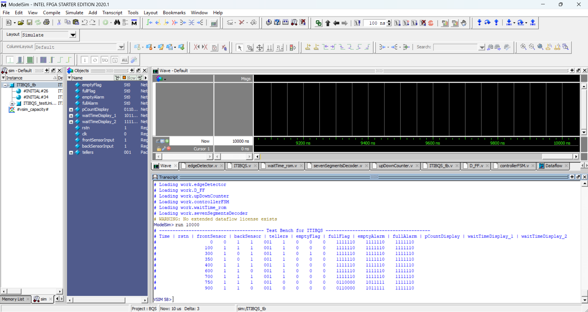

# 🏦 ITIBQS — Intelligent Time-Informed Bank Queue System

> A synthesizable Verilog RTL design of a smart queue management system that tracks customer count and displays real-time estimated waiting times based on active teller availability.

---

## 📌 Project Overview

ITIBQS (Intelligent Time-Informed Bank Queue System) is a hardware digital logic design implemented in Verilog HDL. It simulates a real-world bank queue scenario where two IR sensors monitor customers entering and leaving, an FSM controller manages queue state, and a lookup ROM provides estimated wait times based on the number of customers and active tellers — all displayed on 7-segment displays.

This project was designed and simulated using **ModelSim** and targets FPGA deployment.

---

## ✨ Features

- 3-state FSM: `EMPTY → COUNT → FULL` with clean state transitions
- Falling-edge detection on sensor inputs using D flip-flop based edge detectors
- 3-bit up/down counter tracking up to 7 customers simultaneously
- Wait time estimation via a 32×8 ROM lookup (`tellers × customers` address space)
- Dual-digit 7-segment BCD display for waiting time + single digit for customer count
- Active-low asynchronous reset throughout
- Alarm signals for overflow (full queue entry attempt) and underflow (empty queue exit attempt)
- Full testbench with `$monitor` transcript output

---

## 🗂️ Project Structure

```
ITIBQS/
├── ITIBQS.v               # Top-level module (system integration)
├── controllerFSM.v        # 3-state FSM: empty, count, full
├── upDownCounter.v        # 3-bit synchronous up/down counter
├── edgeDetector.v         # Falling-edge detector (uses D_FF)
├── D_FF.v                 # D flip-flop — async active-low reset
├── waitTime_rom.v         # 32×8 ROM for wait time lookup
├── waitTime_rom.txt       # ROM initialization data (binary)
├── sevenSegmentsDecoder.v # 4-bit to 7-segment BCD decoder
└── ITIBQS_tb.v            # Testbench with full stimulus sequence
```

---

## 🧩 System Architecture

```
frontSensor ──► edgeDetector ──┐
                               ├──► controllerFSM ──► enable, upDown ──► upDownCounter ──► pCount
backSensor  ──► edgeDetector ──┘        │                                                    │
                                        └──► emptyAlarm, fullAlarm, emptyFlag, fullFlag       │
                                                                                              │
tellers[2:0] ────────────────────────────────────────────────────────────► addr[4:2]          │
pCount[2:0]  ◄─────────────────────────────────────────────────────────────────────── addr[1:0]
                                                                                              │
addr[4:0] ──► waitTime_ROM ──► data[7:0] ──► sevenSeg decoder ──► waitTimeDisplay_1 [6:0]
                                         └──► sevenSeg decoder ──► waitTimeDisplay_2 [6:0]
pCount    ──────────────────────────────────► sevenSeg decoder ──► pCountDisplay     [6:0]
```

---

## 🖥️ Simulation Screenshots

Full waveform and project view screenshots from ModelSim are available in the [`/screenshots`](./screenshots) folder of this repo.


 


### Example: Simulation Waveform


### Example: Top-Level Module Source


> 💡 **Setup tip**: create a `/screenshots` folder in your repo root and upload all the `.png` files there. The image links above use relative paths and will render automatically once the folder exists.

---

## ⚙️ Module Descriptions

### `ITIBQS.v` — Top-Level Integration
Instantiates and wires all sub-modules. Computes teller count as a popcount of the `tellers[2:0]` input and forms the 5-bit ROM address.

### `controllerFSM.v` — Queue State Machine
| State   | Condition to enter                        | Behavior                              |
|---------|-------------------------------------------|---------------------------------------|
| `empty` | Reset, or count reaches 0                 | Disables counter, blocks leave events |
| `count` | First customer enters                     | Counts up/down based on sensor events |
| `full`  | `pCount` reaches 7                       | Disables counter, blocks enter events |

Combinational logic handles `emptyFlag`, `fullFlag`, `emptyAlarm`, and `fullAlarm` directly from `pCount` bits.

### `upDownCounter.v` — 3-bit Up/Down Counter
Synchronous counter with active-low reset. Increments or decrements on rising clock edge when `enable` is asserted, controlled by the `upDown` signal.

### `edgeDetector.v` — Falling-Edge Detector
Detects the falling edge of sensor input using a D flip-flop delay: `edgeEvent = delayedInput & ~currentInput`. Triggers one clock cycle after the sensor goes low.

### `D_FF.v` — D Flip-Flop
Positive edge-triggered, active-low asynchronous reset D flip-flop. Used as the delay element inside `edgeDetector`.

### `waitTime_rom.v` — Wait Time ROM (32×8)
Combinational ROM initialized from `waitTime_rom.txt`. Address is `{tellersCount[1:0], pCount[2:0]}` (5 bits). Output is 8-bit BCD-encoded wait time split across two 4-bit nibbles for dual 7-segment display.

### `sevenSegmentsDecoder.v` — 7-Segment BCD Decoder
Decodes a 4-bit binary input (0–9) to the corresponding 7-segment display pattern. Default case outputs all segments OFF.

---

## 🧪 Testbench Scenarios

The testbench (`ITIBQS_tb.v`) covers the following scenarios in sequence:

| Step | Scenario                              | Expected Outcome                     |
|------|---------------------------------------|--------------------------------------|
| 1    | Active-low reset                      | System initializes to `empty` state  |
| 2    | Leave event on empty queue            | `emptyAlarm` asserts                 |
| 3    | 7 customers enter via back sensor     | FSM transitions → `count` → `full`   |
| 4    | Enter event on full queue             | `fullAlarm` asserts                  |
| 5    | Change tellers: 1 → 3                 | ROM address updates, wait time drops |
| 6    | 7 customers leave via front sensor    | FSM transitions back → `empty`       |

---

## 🔧 Simulation Setup

### Prerequisites
- ModelSim (Starter or full edition) or any Verilog simulator (Icarus Verilog, Vivado)

### Running in ModelSim
```tcl
# 1. Create a new project and add all .v files
# 2. Compile all sources
vlog *.v

# 3. Start simulation
vsim ITIBQS_tb

# 4. Add signals to waveform window and run
add wave *
run -all
```

### Running with Icarus Verilog (free/open-source)
```bash
iverilog -o itibqs_sim *.v
vvp itibqs_sim
```

> ⚠️ Make sure `waitTime_rom.txt` is in the same directory as the simulation working directory so `$readmemb` can find it.

---

## 📊 Timing

- Timescale: `10ns / 1ns`
- Clock period: 100ns (defined in testbench)
- All flip-flops are positive edge-triggered with asynchronous active-low reset

---

## 🚀 Potential Extensions

- Extend counter width for larger queue capacity
- Add a real-time clock to dynamically update wait times
- Implement on an FPGA (Basys 3 / DE10-Lite) with physical 7-segment displays and IR sensors
- Add a priority queue feature for VIP customers
- Replace ROM with a real-time computational model

---

## 🎓 About

This project was developed as part of a digital design / HDL coursework for a Mechatronics Engineering program. It demonstrates RTL design principles including FSM design, synchronous digital circuits, ROM-based lookup tables, and modular hardware description.

---

## 📄 License

This project is open for educational use. Attribution appreciated.
